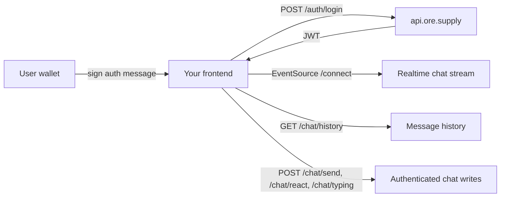

# ORE Chat Integration Docs

Public integration notes for adding the ORE community chat experience to an ORE-adjacent app, including refinORE-style mining dashboards and gOREat Wall / Motherlode prediction-market frontends.

This repo is intentionally **integration-level only**: auth flow, realtime reads, send/reaction calls, UI placement, and safety boundaries. It does not include private strategy logic, backend credentials, proprietary mining heuristics, or production secrets.

## Quick links

- [ORE Supply chat API integration](docs/ore-supply-chat.md)
- [Embed chat in a refinORE-style mining app](docs/refinore-embedded-chat.md)
- [Embed chat in a gOREat Wall / tile-market app](docs/goreat-wall-tiles-chat.md)
- [Minimal Next.js client example](examples/nextjs)

## What you can build

- Live community chat using ORE Supply-compatible public endpoints.
- Wallet signature auth for sending messages, reactions, and typing indicators.
- A collapsible desktop sidebar or mobile bottom-sheet chat UI.
- A shared chat panel beside ORE mining or prediction-market state without interfering with transactions.

## Core integration shape

## Non-goals

- No private key handling.
- No escrow, mining, tile-buying, or settlement code.
- No hidden alpha / strategy internals.
- No server-side proxy required for the public chat flow.

## License

MIT
